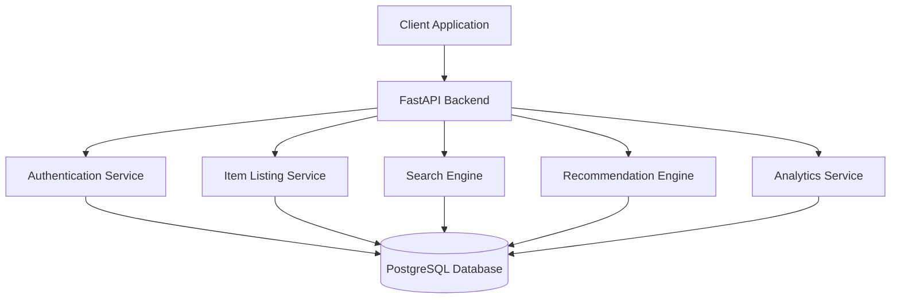
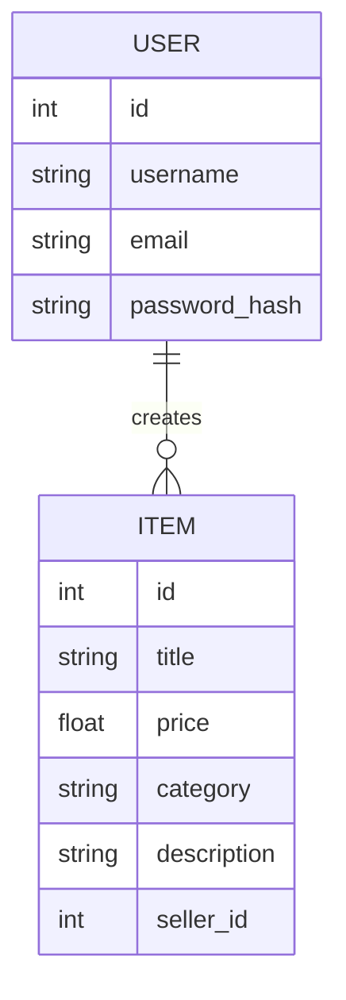

# 🛒 Smart Marketplace Engine  
### AI-Powered Marketplace Backend & Recommendation System


A production-style backend system for a marketplace platform built using **FastAPI, PostgreSQL, and AI-powered recommendations**.

This project simulates the backend architecture used in modern marketplace platforms by implementing:

- Secure user authentication  
- Marketplace item listings  
- Keyword-based search system  
- AI-powered recommendation engine  
- Marketplace analytics APIs  
- Containerised deployment using Docker  

---

# 🌐 API Documentation

Interactive API documentation via Swagger UI:

```
http://127.0.0.1:8000/docs
```

Swagger provides a full interactive interface for testing all API endpoints.

---

# 🎯 Project Objective

The objective of this project is to design and implement a **scalable backend architecture for a marketplace platform**.

Users of the platform can:

- Register and authenticate securely  
- Create and manage marketplace listings  
- Search items efficiently  
- Receive AI-based recommendations  
- Analyse marketplace trends using analytics endpoints  

The system demonstrates **real-world backend architecture patterns used in production systems**.

---

# 🛠️ Tech Stack

| Category | Tools |
|---|---|
| Language | Python |
| Backend Framework | FastAPI |
| Database | PostgreSQL |
| ORM | SQLAlchemy |
| Authentication | JWT |
| Security | Bcrypt Password Hashing |
| Machine Learning | Scikit-learn |
| Infrastructure | Docker |
| Documentation | Swagger / OpenAPI |
| Version Control | Git & GitHub |

---

# ⚙️ System Architecture

```
Client
   ↓
FastAPI Backend
   ↓
Authentication Layer (JWT)
   ↓
Marketplace Services
 ├─ User Management
 ├─ Item Listing
 ├─ Search Engine
 ├─ AI Recommendation Engine
 └─ Analytics Service
   ↓
PostgreSQL Database
```

---

# 🏗️ System Design Diagram

The backend follows a modular service-oriented architecture.



---

# 🗄️ Database Schema

The system uses a relational database with the following core entities.



---

# 🚀 Core Features

## 👤 User Authentication

Secure authentication system with password hashing and JWT tokens.

Endpoints:

- POST /users/register  
- POST /users/login  

Validation rules:

- Username must be **6–12 characters**
- Password must contain **uppercase, lowercase, number, and special character**
- Email format validation included

### Example Request

POST /users/register

```json
{
  "username": "premnadh",
  "email": "prem123@gmail.com",
  "password": "Prem@123"
}
```

### Example Response

```json
{
  "id": 175,
  "username": "premnadh",
  "email": "prem123@gmail.com"
}
```

---

# 📦 Marketplace Item Listing

Users can create and manage marketplace listings.

Endpoints:

- POST /items/create  
- GET /items  
- GET /items/{item_id}  
- DELETE /items/{item_id}

Item attributes include:

- title  
- price  
- category  
- description  
- seller_id  

---

# 🔎 Search System

Marketplace search functionality allows users to find items quickly.

Endpoint:

```
GET /items/search?q=keyword
```

Example:

```
/items/search?q=iphone
```

Features:

- Keyword search  
- Category filtering  

---

# 🤖 AI Recommendation Engine

The backend includes a **content-based recommendation system** that suggests similar marketplace items.

Algorithm used:

- TF-IDF vectorisation
- Cosine similarity

### Recommendation Workflow

```
Item title + description
        ↓
TF-IDF vectorisation
        ↓
Cosine similarity comparison
        ↓
Top similar items returned
```

Endpoint:

```
GET /recommendations/{item_id}
```

### Example Recommendation Response

```json
{
  "item_id": 52,
  "recommended_items": [
    {
      "id": 48,
      "title": "iPhone 12 Pro",
      "similarity_score": 0.92
    },
    {
      "id": 37,
      "title": "iPhone 11",
      "similarity_score": 0.89
    }
  ]
}
```

---

# 📊 Marketplace Analytics

Analytics endpoints provide insights into marketplace activity.

Endpoints:

- GET /analytics/popular-items  
- GET /analytics/top-categories  
- GET /analytics/price-distribution  

These APIs analyse:

- Most popular listings  
- Category trends  
- Price distribution patterns  

---

# 🔗 API Endpoints

| Method | Endpoint | Description |
|------|------|------|
| POST | /users/register | Register new user |
| POST | /users/login | Authenticate user |
| POST | /items/create | Create marketplace listing |
| GET | /items | Retrieve all items |
| GET | /items/{item_id} | Retrieve specific item |
| DELETE | /items/{item_id} | Delete item |
| GET | /items/search?q= | Search items |
| GET | /recommendations/{item_id} | Get recommended items |
| GET | /analytics/popular-items | Popular listings |
| GET | /analytics/top-categories | Category insights |
| GET | /analytics/price-distribution | Price distribution analysis |

---

# 🧠 API Workflow Example

```
User registers
        ↓
User logs in
        ↓
JWT token generated
        ↓
User creates item listing
        ↓
Items searchable
        ↓
Recommendation engine suggests similar items
```

---

# ⚡ Performance Considerations

To maintain performance as marketplace data grows, the system includes:

- Indexed database queries for faster search
- Pagination support for large item lists
- Asynchronous FastAPI endpoints
- Efficient TF-IDF vectorisation for recommendation computation
- Containerised services enabling scalable deployment

Future performance improvements may include:

- Redis caching
- Background processing using Celery
- Vector databases for large-scale similarity search

---

# 🔐 Security Design

Security is implemented using several best practices:

- Password hashing using **bcrypt**
- **JWT-based authentication** for stateless sessions
- Input validation using **Pydantic schemas**
- Protected API endpoints requiring authentication
- SQLAlchemy ORM preventing SQL injection vulnerabilities

Potential security improvements:

- API rate limiting
- OAuth authentication
- Refresh token rotation

---

# 🧪 API Usage Examples

Example API requests using `curl`.

These examples demonstrate how the API can be used programmatically from the command line or other services.

---

## Register User

```bash
curl -X POST http://127.0.0.1:8000/users/register \
-H "Content-Type: application/json" \
-d '{
"username": "premnadh",
"email": "prem123@gmail.com",
"password": "Prem@123"
}'
```

---

## Login

```bash
curl -X POST http://127.0.0.1:8000/users/login \
-H "Content-Type: application/json" \
-d '{
"username": "premnadh",
"password": "Prem@123"
}'
```

Response

```json
{
"access_token": "jwt-token",
"token_type": "bearer"
}
```

---

## Create Item Listing

```bash
curl -X POST http://127.0.0.1:8000/items/create \
-H "Authorization: Bearer YOUR_JWT_TOKEN" \
-H "Content-Type: application/json" \
-d '{
"title": "iPhone 13",
"price": 650,
"category": "electronics",
"description": "Excellent condition iPhone",
"seller_id": 175
}'
```

---

## Search Items

```bash
curl "http://127.0.0.1:8000/items/search?q=iphone"
```

---

## Get Recommendations

```bash
curl "http://127.0.0.1:8000/recommendations/52"
```

---

## Get Popular Items

```bash
curl "http://127.0.0.1:8000/analytics/popular-items"
```
---
# ▶️ Run Locally

Clone repository

```
git clone https://github.com/premnadh/smart-marketplace-engine.git
```

Navigate into project

```
cd smart-marketplace-engine
```

Install dependencies

```
pip install -r requirements.txt
```

Start PostgreSQL container

```
docker compose up -d
```

Run the API server

```
uvicorn app.main:app --reload
```

Open API documentation

```
http://127.0.0.1:8000/docs
```

---

# 📂 Project Structure

```
smart-marketplace-engine
│
├── app
│   ├── api
│   │   ├── users.py
│   │   ├── items.py
│   │   └── analytics.py
│   │
│   ├── ai
│   │   └── recommender.py
│   │
│   ├── database
│   │   └── db.py
│   │
│   ├── models
│   │   ├── user.py
│   │   └── item.py
│   │
│   ├── schemas
│   │   ├── user_schema.py
│   │   └── item_schema.py
│   │
│   ├── utils
│   │   ├── auth.py
│   │   └── jwt_handler.py
│   │
│   └── main.py
│
├── scripts
│   └── seed_data.py
│
├── Dockerfile
├── docker-compose.yml
├── requirements.txt
└── README.md
```

---

# ⭐ Key Features

- Secure JWT authentication
- Marketplace item listing system
- Search functionality
- AI-powered recommendation system
- Marketplace analytics APIs
- PostgreSQL database integration
- Docker container deployment
- Modular backend architecture

---

# 🚀 Future Improvements

Potential future upgrades for the system include:

- Advanced search ranking algorithm
- Redis caching for faster API responses
- Real-time recommendation updates
- Frontend marketplace interface
- Cloud deployment (AWS / GCP / Render)
- Microservices-based architecture

---

# 👤 Author

**Prem Nadh Gajula**

Aspiring **Data Scientist | Machine Learning Engineer | Backend Developer**

Interested in:

- AI systems  
- backend architecture  
- machine learning applications  

If you like this project, consider ⭐ starring the repository.